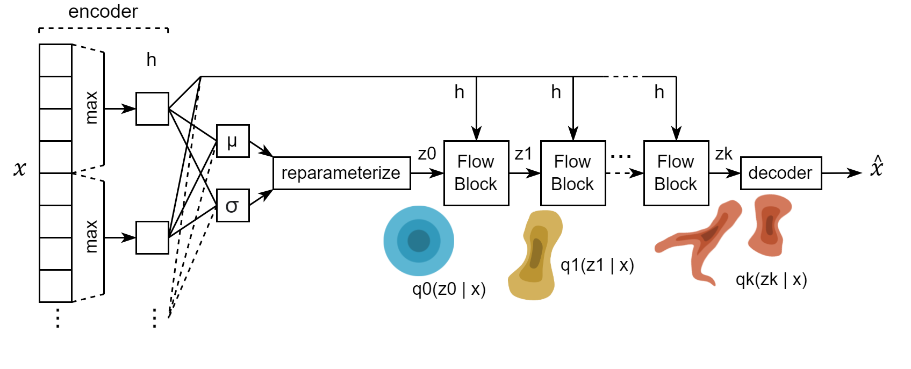

# Variational Inference with Normalizing Flows 

**ATML Group 9 - HT22**

Repository containing code for the reproducibility challenge set as an exam in the ATML HT22 course. A reproduction of the results of the [original paper](https://arxiv.org/abs/1505.05770) by Danilo Jimenez Rezende and Shakir Mohamed. 

The code for the Sylvester flows in `flows.py` is adapted from https://github.com/riannevdberg/sylvester-flows.

Examples of how to train and evaluate the models are found in the Jupyter notebooks `train_MNIST` and `train_CIFAR`.

|
|:--:| 
| *Model architecture* |

|
|:--:| 
| *Effect of the flow-length on MNIST* |

| 
|:--:| 
| *Effect of planar and radial normalising flows on two standard distributions* |

| 
|:--:| 
|*Approximating complex 2D distributions* |

| 
|:--:| 
| *Original input $`{x}`$ and the reconstructed $`\hat{x}`$* |

